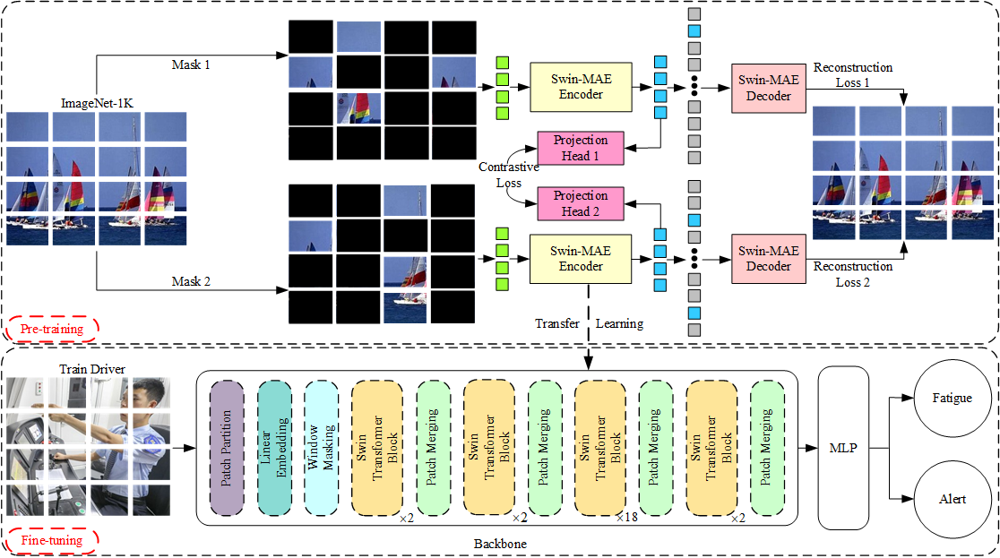
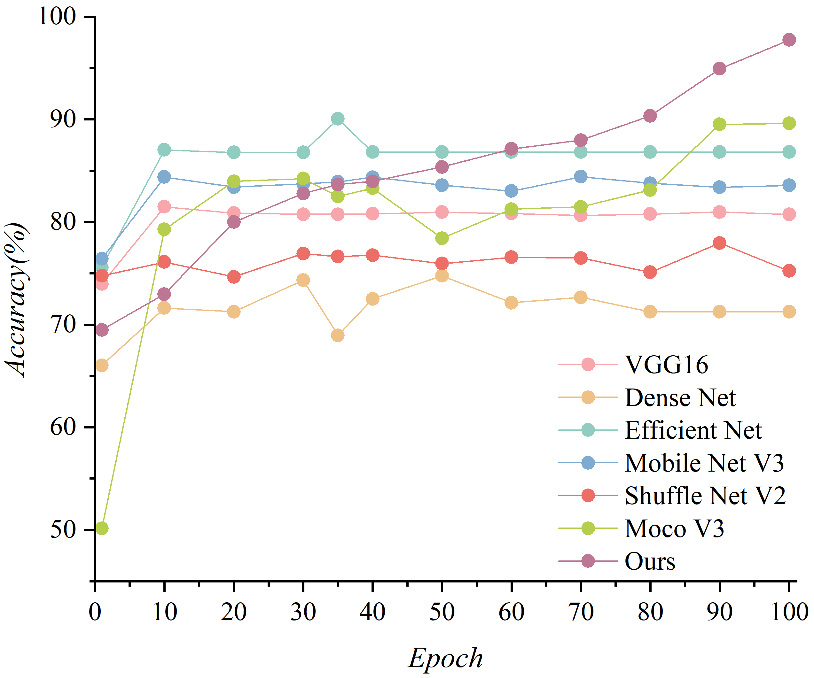
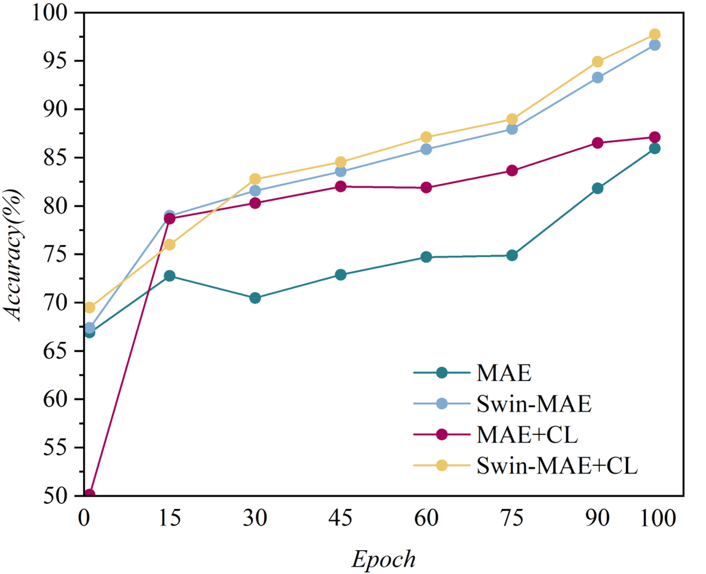
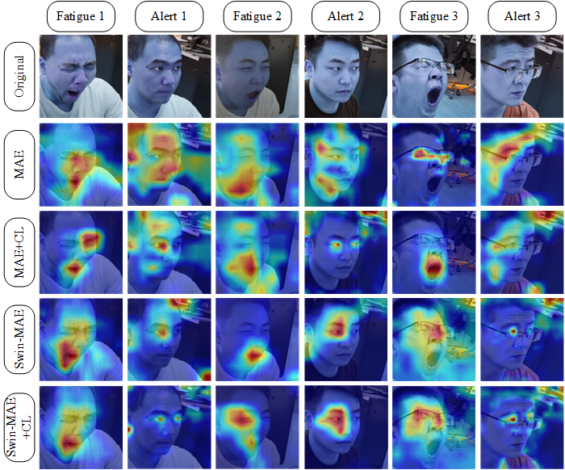

# Swin-MAE

### A Self-supervised Framework Combining Swin-MAE and Contrastive Learning for Train Driver  Fatigue Detection




## Introduction

In this work, we propose a new method for detecting driving fatigue of train drivers. It is a self supervised learning framework based on mask image modeling. Adopting a structurally improved Swin transformer as the encoder, and enhancing its image feature extraction capability through contrastive learning structure. Expand our self built train driver fatigue dataset using multiple data augmentation strategies. Meanwhile, we have chosen the optimal masking strategy.


## Main Results

In this work, we compared our model with six benchmark models. Finally, after 100 rounds of fine-tuning, the Swin MAE contrastive learning model surpassed all contrastive models with a detection accuracy of 97.73%, verifying its effectiveness in train driver fatigue detection tasks.

<div align="center">
    
</div>

### Fine-tuning Model Based on ViT

| name | Fine-tuning epochs | pre-train resolution | fine-tune resolution | acc@1 | pre-trained model |
| :---: | :---: | :---: | :---: | :---: | :---: |
| MAE | 100 | 224x224 | 224x224 | 86.57 | [pth](通过网盘分享的文件：finetune_vit
链接: https://pan.baidu.com/s/17OyX3-cpDK0Q0-aacWGY-Q?pwd=5fxy 提取码: 5fxy)/[config](configs/swinmae_finetune__vit_base__img224__800ep.yaml) | 

### Fine-tuning Model Based on Swin-MAE

| name | Fine-tuning epochs | pre-train resolution | fine-tune resolution | acc@1 | pre-trained model |
| :---: | :---: | :---: | :---: | :---: | :---: |
| SwinMAE | 100 | 224x224 | 224x224 | 96.65 | [pth](通过网盘分享的文件：finetune_swin
链接: https://pan.baidu.com/s/1367-AFLMfZqsTHNmKhMkWQ?pwd=mfmb 提取码: mfmb)/[config](configs/swinmae_finetune__swin_base__img224_window7__800ep.yaml) | 

## Comparison of Backbone Results
This study implements two core improvements based on the MAE (Masked Autoencoder) framework: replacing the visual Transformer backbone network with a hierarchical Swin Transformer architecture, and innovatively integrating window masking mechanism and contrastive learning module to construct a Swin MAE pre training model. To evaluate the effectiveness of different technological routes in the system, this paper sets up four control experiments (basic MAE, Swin MAE, MAE+CL, Swin MAE+CL), and compares the performance of downstream tasks after fine-tuning the backbone network.



In order to more intuitively demonstrate the superiority of the Swin MAE based train driver fatigue detection model over the benchmark model, we conducted model attention visualization. The attention range of Swin MAE+CL is also focused on the eyes and mouth of the train driver, and the highlighted parts are further narrowed, indicating that the model has learned how to better focus on the parts of the global features that are highly related to fatigue representation. It can better learn the deep level fatigue feature information, avoiding the problems of feature redundancy and high computational cost.



## Other Model
The other model folder contains the training codes for MOCOv3 and MAE, and their weights can be downloaded from here.
MOCO v3:[pth](通过网盘分享的文件：mocov3权重
链接: https://pan.baidu.com/s/1vY9zI55e2OTJWjsRqFsQQg?pwd=26bi 提取码: 26bi)
MAE:[pth](通过网盘分享的文件：MAE权重
链接: https://pan.baidu.com/s/18rYhbILR9sV-rMlojXF6XA?pwd=xvy5 提取码: xvy5)


## Installation

 The Swin-MAE requirements are listed in the `requirement.txt` file. To create your own environment, an example is:

```bash
pip install torchvision==0.8.2 torchaudio==0.7.2 install timm==0.4.9 opencv-python==4.4.0.46 termcolor==1.1.0 yacs==0.1.8 diffdist  
pip install -r requirements.txt #Or you can run this command
cd apex
pip install -v --disable-pip-version-check --no-cache-dir ./
cd .. #Return to Swin MAE folder
export MASTER_ADDR=localhost #Enter on the command line
export MASTER_PORT=5678
```
This work used the Pre-training dataset which can be downloaded from this [ImageNet-1k-download](https://www.image-net.org/download.php).
For privacy reasons, our self built train driver fatigue dataset may not be publicly available. Please use your own dataset instead。
## Train

 The training continues by using a pretrained model from our work, an example is:

```bash
python main.py  --cfg configs/swinmae_finetune__swin_base__img224_window7__800ep.yaml --pretrained swinmae_finetune__swin_base__img224_window7__800ep.pth --data-path /hy-tmp/imagenet --local_rank 0 --batch-size 16
```
 New training using the MIM pretrained model, an example is:

```bash
python main.py  --cfg configs/swinmae_pretrain__swin_base__img192_window6__800ep.yaml --pretrained swinmae_pretrain__swin_base__img192_window6__800ep.pth --data-path dataset --local_rank 0 --batch-size 16
```

## Evaluation

The evaluation configurations can be adjusted at `main_eval.py`.
Get the confusion matrix results you need in the confusion matrix folder.

```bash
cd eval
python main_eval.py --eval  --cfg configs/swinmae_finetune__vit_base__img224__800ep.yaml  --resume ./swinmae_finetune__vit_base__img224__800ep.pth --local_rank 0 --data-path  dataset
```

## Inference

Print the detection results of the weights model and output the txt file.


```bash
cd eval
python inference.py --cfg configs/swinmae_finetune__vit_base__img224__800ep.yaml  --resume ./swinmae_finetune__vit_base__img224__800ep.pth --local_rank 0
```
You can modify the inference code to customize the inference categories and data input path.

## Citation

If you are interested in this work, please cite the following work:

```
@article{zhou2025novel,
  title={A Self-supervised Framework Combining Swin-MAE and Contrastive Learning for Train Driver  Fatigue Detection},
  author={Zhou, Xinghong and Li, Taiguo and Peng, Jiajun and Li, Xiaoping},
  journal={IEEE Internet of Things Journal},
  year={2025},
  publisher={IEEE}
}
```

## Acknowledgments

Our work is based on [Swin Transformer](https://github.com/microsoft/Swin-Transformer) and [Sim MIM](https://github.com/microsoft/SimMIM).  We appreciate the previous open-source repository [Swin Transformer](https://github.com/microsoft/Swin-Transformer) and [Sim MIM](https://github.com/microsoft/SimMIM).

